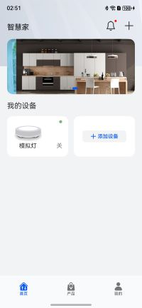

# 实用工具(智慧家居)行业模板快速入门

## 目录

- [功能介绍](#功能介绍)
- [环境要求](#环境要求)
- [快速入门](#快速入门)
- [示例效果](#示例效果)
- [权限要求](#权限要求)
- [开源许可协议](#开源许可协议)


## 功能介绍

本模板构建了一款包含设备添加、设备管理的智能家居应用，并构建了设备模拟端，实现与该模板的蓝牙、MQTT交互，从而整体功能的闭环展示。模板主要分首页、产品和我的三大模块：

* 首页：提供添加设备的功能，支持自动扫描、扫码和手动添加三种方式。

* 产品：展示月激活量大的产品列表。

* 我的：提供账号管理、授权管理、意见反馈、帮助中心等功能。

| 首页                               | 产品                                  | 我的                              | 设备模拟                                        |
|----------------------------------|-------------------------------------|---------------------------------|---------------------------------------------|
|  |  |  |  |


本模板主要页面及核心功能如下所示：

```ts
智能家居
 |-- 首页
 |    |-- 设备添加
 |    |    |-- 设备蓝牙发现
 |    |    |    |-- 自动扫描
 |    |    |    |-- 扫码添加
 |    |    |    |-- 手动添加
 |    |    |    |    |-- 产品列表
 |    |    |    |    └-- 添加向导（H5）
 |    |    |    |-- 重新发现 
 |    |    |    └-- 发现的设备列表
 |    |    |-- 设备蓝牙连接
 |    |    |-- 设备wifi选择
 |    |    |    └-- 识别可用wifi
 |    |    └-- 设备配置
 |    |-- 设备管理
 |    |    |-- 设备卡片
 |    |    |    |-- 设备名称
 |    |    |    |-- 连接状态
 |    |    |    └-- 设备状态（H5）
 |    |    └-- 设备详情
 |    |         |-- 基本设置
 |    |         |    └-- 编辑设备名称
 |    |         |-- 删除设备
 |    |         |-- 设备状态显示（H5）
 |    |         └-- 设备远程控制（H5）
 |    └-- 设备消息
 |         |-- 消息提醒
 |         |    |-- 全局消息提醒
 |         |    └-- 设备消息提醒
 |         |-- 消息分类
 |         |    |-- 全部
 |         |    |-- 已读
 |         |    └-- 未读
 |         └-- 消息列表
 |              └-- 按时间展示
 |-- 产品
 |    └-- 产品展示
 └-- 我的
      |-- 个人中心
      |    |-- 编辑昵称
      |    └-- 编辑头像
      |-- 权限管理
      |    └-- 蓝牙权限
      |-- 意见反馈
      |-- 帮助中心
      |    └-- 呼叫客服
      └-- 关于我们
      
设备模拟
 |--本端开关灯
 |--响应远端控制
 └--蓝牙广播
```

本模板分层结构如下所示：


本模板工程代码结构如下所示：

```ts
SmartHome
 ├─commons                                                      // 公共层
 │  ├─external_interactions                                     // 外部交互
 │  │  └─src                                                     
 │  │      └─main                                                
 │  │          └─ets                                             
 │  │                  RemoteProxyModel.ets                     // 代理后端
 │  │                                                            
 │  ├─uicomponents                                              // 公共UI组件 
 │  │  └─src                                                    
 │  │      └─main                                                
 │  │          └─ets                                             
 │  │                  AccessSettingBarView.ets                 // 应用权限设置bar视图
 │  │                  CommonBarView.ets                        // 公共bar视图
 │  │                  DeviceBaseInfoView.ets                   // 设备基本信息视图，图片+名字
 │  │                  ImageSettingBarView.ets                  // 图片设置bar视图，例如设置头像
 │  │                  NavBarListView.ets                       // 导航bar列表视图，用于我的页面
 │  │                  NavBarView.ets                           // 单个导航bar视图
 │  │                  SettingBarView.ets                       // 设置bar视图，供图片、文字设置bar使用
 │  │                  TextBarView.ets                          // 展示文字的bar视图
 │  │                  TextSettingBarView.ets                   // 文字设置bar视图，例如设备名称
 │  │                  TextShowBarView.ets                      // 文字显示bar视图，例如账号信息
 │  │                                                            
 │  └─utils                                                     // 公共功能
 │      └─src                                                    
 │          └─main                                               
 │              └─ets                                            
 │                      Constants.ets                           // 常量定义
 │                      LogUtil.ets                             // 日志
 │                      ObserverMngModel.ets                    // 观察者模式，供viewModel层订阅model层数据
 │                      StorageUtil.ets                         // 数据存储
 │                      Tools.ets                               // 小工具
 │                                                               
 ├─features                                                     // 特性层
 │  ├─device_add                                                // 设备添加特性
 │  │  └─src                                                     
 │  │      └─main                                                
 │  │          └─ets                                             
 │  │              ├─model                                      // model层
 │  │              │      BleClientModel.ets                    // ble客户端模型，包括ble扫描、连接等
 │  │              │      GetWifiInfoModel.ets                  // 获取周边wifi信息模型
 │  │              │                                             
 │  │              ├─pages                                      // page页
 │  │              │      AddDevicePage.ets                     // 添加设备页
 │  │              │      AddInstructionPage.ets                // 添加指导页
 │  │              │      ConfigDevicePage.ets                  // 配置设备页
 │  │              │      ManualAddPage.ets                     // 手动添加设备页
 │  │              │      SearchDevicePage.ets                  // 搜索设备页
 │  │              │      SelectWifiPage.ets                    // 设置wifi页
 │  │              │                                             
 │  │              ├─view                                       // view层
 │  │              │      AddButtonView.ets                     // 扫码添加/手动添加视图
 │  │              │      AddEntryView.ets                      // 添加设备的+号视图
 │  │              │      BleScannedDevicesView.ets             // ble扫描出的设备展示视图
 │  │              │      BleScanView.ets                       // ble扫描视图
 │  │              │      TwoLevelListView.ets                  // 二级联动列表视图
 │  │              │                                             
 │  │              └─viewmodel                                  // viewModel层
 │  │                      AddDeviceViewModel.ets               // 添加设备视图模型
 │  │                      AddInstructionViewModel.ets          // 添加指导视图模型
 │  │                      BleScanViewModel.ets                 // ble扫描视图模型
 │  │                      ConfigDeviceViewModel.ets            // 配置设备视图模型
 │  │                      ProductListViewModel.ets             // 手动添加页的商品列表视图模型
 │  │                      SearchDeviceViewModel.ets            // 搜索设备视图模型
 │  │                      SelectWifiViewModel.ets              // 设置wifi视图模型
 │  │                                                            
 │  ├─device_mng                                                // 设备管理特性
 │  │  └─src                                                     
 │  │      └─main                                                
 │  │          └─ets                                             
 │  │              ├─model                                      // model层
 │  │              │      AddedDevicesModel.ets                 // 设备管理模型
 │  │              │      MqttClientModel.ets                   // mqtt客户端模型
 │  │              │      WebInteractModel.ets                  // ets与h5交互模型
 │  │              │                                             
 │  │              ├─pages                                      // page页
 │  │              │      BaseSettingPage.ets                   // 设备基本信息设置页
 │  │              │      DeviceDetailPage.ets                  // 设备详细页
 │  │              │      DeviceNotifyListPage.ets              // 单设备的通知消息列表页
 │  │              │      DevicesNotifyPage.ets                 // 所有设备的最新通知消息页
 │  │              │                                             
 │  │              ├─view                                       // view层
 │  │              │      DeviceCardView.ets                    // 首页的设备卡片视图
 │  │              │      DeviceCommonInfoView.ets              // 设备详情页中的设备公共信息视图
 │  │              │      DeviceNotifyListView.ets              // 设备通知消息列表视图
 │  │              │      DevicePrivateInfoView.ets             // 设备详情页中的设备私有信息视图
 │  │              │      DevicesNotifyView.ets                 // 所有设备的最新通知消息视图
 │  │              │      NotifyEntryView.ets                   // 用于首页的通知图标视图
 │  │              │                                             
 │  │              └─viewmodel                                  // viewModel层
 │  │                      BaseSettingViewModel.ets             // 设备基本信息设置视图模型
 │  │                      DeviceCardViewModel.ets              // 单个设备卡片视图模型
 │  │                      DeviceDetailViewModel.ets            // 设备详细视图模型
 │  │                      DeviceNotifyListViewModel.ets        // 设备通知消息列表视图模型
 │  │                      DevicesCardsViewModel.ets            // 所有设备卡片的视图模型
 │  │                      DevicesNotifyViewModel.ets           // 所有设备的最新通知消息视图模型
 │  │                      NotifyEntryViewModel.ets             // 用于首页的通知图标视图模型
 │  │                                                            
 │  └─device_service                                            // 设备服务特性
 │      └─src                                                    
 │          └─main                                               
 │              └─ets                                            
 │                  ├─model                                     // model层
 │                  │      ErrorCodeEntity.ets                  // 登录错误码
 │                  │      PersonalInfoModel.ets                // 个人信息模型
 │                  │                                            
 │                  ├─pages                                     // page页
 │                  │      AboutUsPage.ets                      // 关于我们页
 │                  │      AdviceFeedbackPage.ets               // 意见反馈页
 │                  │      HelpCenterPage.ets                   // 帮助中心页
 │                  │      PersonalCenterPage.ets               // 个人中心页
 │                  │      PrivacyPolicyPage.ets                // 隐私政策页
 │                  │      QuickLoginPage.ets                   // 快速登录页
 │                  │      TermsOfServicePage.ets               // 用户协议页
 │                  │                                            
 │                  ├─view                                      // view层
 │                  │      AgreementView.ets                    // 用于登录页的同意对话框
 │                  │      PersonalProfileView.ets              // 个人头像/昵称视图
 │                  │      PersonalTitleView.ets                // 个人标题，首页左上角
 │                  │                                            
 │                  └─viewmodel                                 // viewModel层
 │                          AdviceFeedbackViewModel.ets         // 意见反馈视图模型
 │                          PersonalCenterViewModel.ets         // 个人中心视图模型
 │                          PersonalProfileViewModel.ets        // 个人头像/昵称视图模型
 │                          PersonalTitleViewModel.ets          // 个人标题视图模型
 │                                                               
 ├─products                                                     // 产品层 
 │  └─phone                                                     // 手机
 │      └─src                                                    
 │          └─main                                               
 │              └─ets                                            
 │                  ├─pages                                     // page页
 │                  │      AccessControlPage.ets                // 权限管理页
 │                  │      HomePage.ets                         // 首页
 │                  │      Index.ets                            // Index
 │                  │      MinePage.ets                         // 我的
 │                  │      ProductPage.ets                      // 产品
 │                  ├─phoneability
 │                  │      PhoneAbility.ets                     // 应用主窗口
 │                  │                                            
 │                  ├─phoneformability                           
 │                  │      PhoneFormAbility.ets                 // 设备桌面卡片
 │                  │                                            
 │                  ├─view                                      // view层
 │                  │      DevicesCardsView.ets                 // 首页的设备卡片视图
 │                  │                                            
 │                  ├─viewmodel                                 // viewModel层
 │                  │      AccessControlViewModel.ets           // 权限管理视图模型
 │                  │      HomeViewModel.ets                    // 首页视图模型
 │                  │      ProductViewModel.ets                 // 产品视图模型
 │                  │                                            
 │                  └─widget                                     
 │                      └─pages                                  
 │                              WidgetCard.ets                  // 桌面设备卡片
 │                                                               
 └─test                                                         // 测试相关 
     └─device_simulation                                        // 设备模拟
         └─src                                                   
             └─main                                              
                 └─ets                                    
                     ├─device_simulationability
                     │      Device_simulationAbility.ets        // 设备模拟窗口
                     ├─model                                    // model层
                     │      ArrayBufferUtils.ets                // ArrayBuffer处理
                     │      BleServerModel.ets                  // ble服务端模型
                     │      LogUtil.ets                         // 日志
                     │      MqttClientModel.ets                 // mqtt客户端模型
                     │                                           
                     └─pages                                    // page页
                             Index.ets                          // Index
```

## 环境要求

### 软件
* DevEco Studio版本：DevEco Studio 5.0.0 Release及以上
* HarmonyOS SDK版本：HarmonyOS 5.0.0 Release SDK及以上
### 硬件
* 设备类型：华为手机（直板机）
* HarmonyOS版本：HarmonyOS 5.0.0 Release及以上


## 快速入门

运行此模板需要使用两台手机，一台运行模拟灯程序，一台运行模板应用，具体操作如下：

1. 在DevEco Studio中打开此模板。

2. 在AppGallery Connect创建应用，将包名配置到模板中。

   a. 参考[创建HarmonyOS应用](https://developer.huawei.com/consumer/cn/doc/app/agc-help-createharmonyapp-0000001945392297)为应用创建APPID，并进行关联。

   b. 返回应用列表页面，查看应用的包名。

   c. 将模板工程根目录下AppScope/app.json5文件中的bundleName替换为创建应用的包名。

3. 连接模拟灯的手机和PC。

4. 对应用进行[手工签名](https://developer.huawei.com/consumer/cn/doc/harmonyos-guides-V5/ide-signing-V5#section297715173233)
   因为需要运行两台手机，所以在注册调试设备时，需要添加两个设备，然后在申请调试Profile时，将两个调试设备都选中。

5. 配置华为账号服务。

   a. 将元服务的client ID配置到phone模块的module.json5文件，详细参考：[配置Client ID](https://developer.huawei.com/consumer/cn/doc/harmonyos-guides-V5/account-client-id-V5)。

   b. 添加公钥指纹，详细参考：[配置应用证书指纹](https://developer.huawei.com/consumer/cn/doc/app/agc-help-signature-info-0000001628566748#section5181019153511)。

   c. 如需获取用户真实手机号及华为账号一键登录，需要申请phone权限和quickLoginMobilePhone权限，详细参考：[配置scope权限](https://developer.huawei.com/consumer/cn/doc/harmonyos-guides-V5/account-config-permissions-V5)。

6. 安装模拟灯程序，选择device_simulation运行。

   

7. 打开模拟灯手机中的蓝牙开关。

   

8. 连接运行模板的手机和PC。

9. 安装模板应用，选择phone运行。

   

10. 在安装模板应用的手机上，点击“添加设备”，将自动扫描到模拟灯，点击模拟灯的“连接”进行Wi-Fi配置，配置完成后，首页将添加模拟灯的卡片，卡片右上角指示灯为绿色，表示已与模拟灯建立网络连接。

	      

11. 在模拟灯的手机上打开“灯开关”，模板应用的模拟灯卡片将显示“开”。

	  

12. 在模板应用中点击模拟灯卡片，进入设备详情页，关闭灯，则模拟灯手机上的模拟灯也将关闭。

	   

【注意】

当前模板基于免费的公共MQTT服务器仅做功能展示，切勿在生产环境中使用，若出现连接失败等情况请尝试重新运行。

公共MQTT broker: https://www.emqx.com/zh/mqtt/public-mqtt5-broker


## 示例效果

[功能展示录屏](./screenshots/sample.avi)


## 权限要求

* 蓝牙权限：ohos.permission.ACCESS_BLUETOOTH
* 网络权限：ohos.permission.INTERNET
* wifi查询权限：ohos.permission.GET_WIFI_INFO


## 开源许可协议

该代码经过[Apache 2.0 授权许可](http://www.apache.org/licenses/LICENSE-2.0)。

