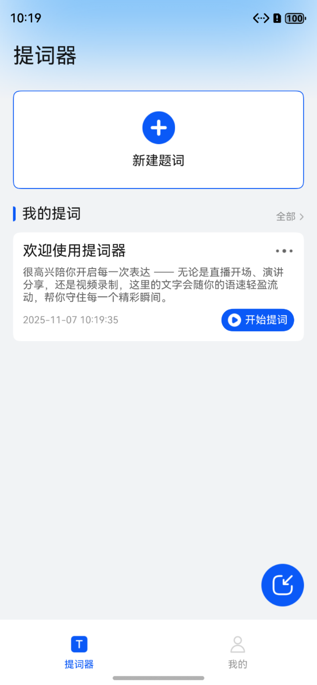
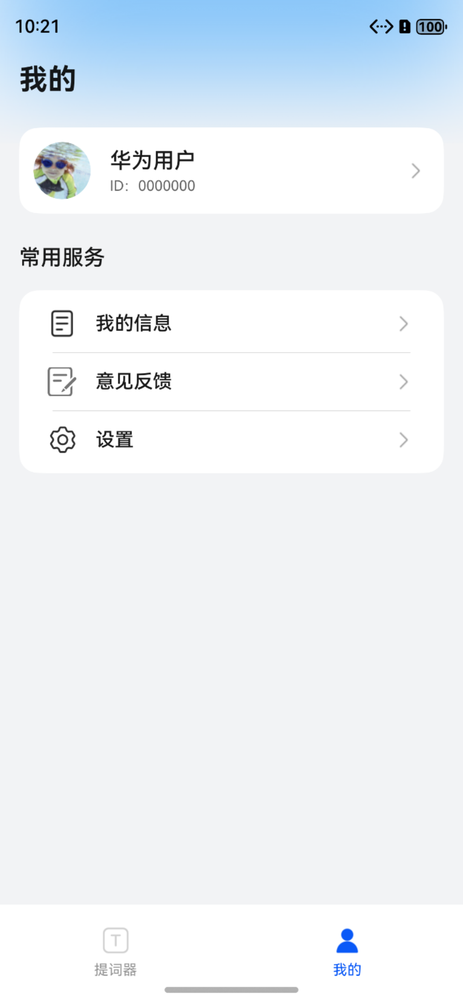
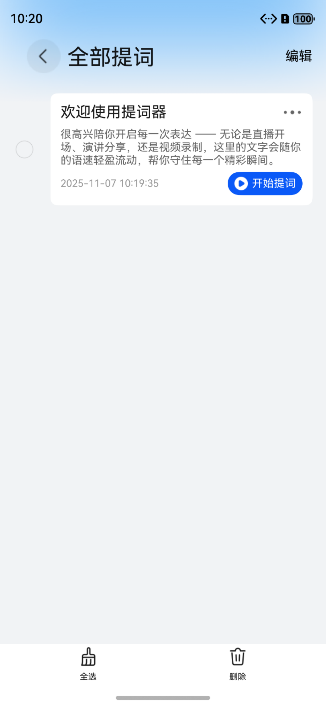
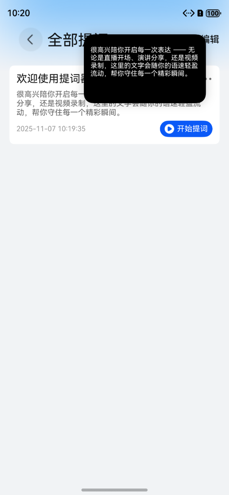
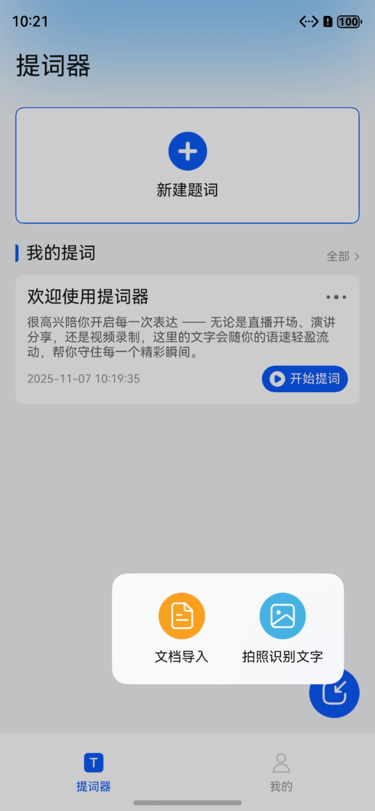
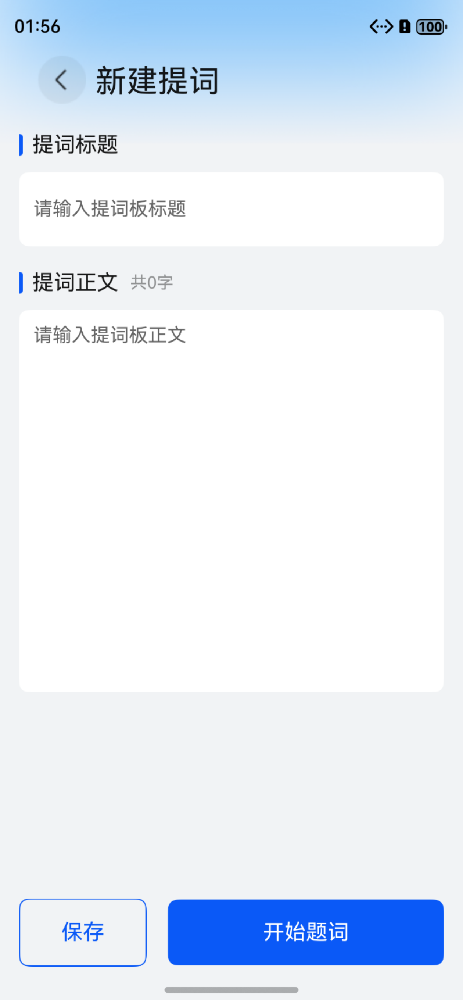
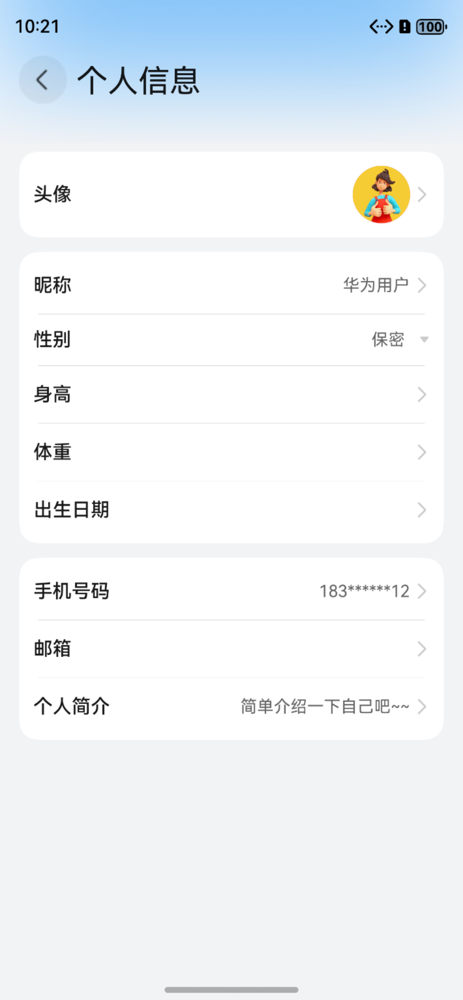
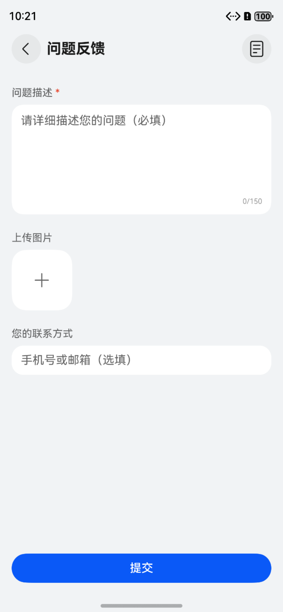
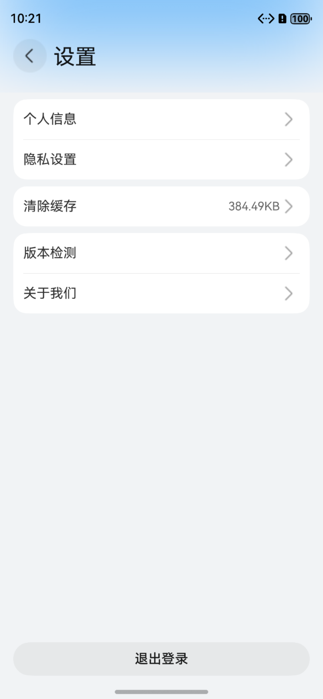

# 工具(提词器)应用模板快速入门

## 目录

- [功能介绍](#功能介绍)
- [约束与限制](#约束与限制)
- [快速入门](#快速入门)
- [示例效果](#示例效果)
- [开源许可协议](#开源许可协议)

## 功能介绍

您可以基于此模板直接定制应用，也可以挑选此模板中提供的多种组件使用，从而降低您的开发难度，提高您的开发效率。

本模板提供如下组件，所有组件存放在工程根目录的components下，如果您仅需使用组件，可参考对应组件的指导链接；如果您使用此模板，请参考本文档。

| 组件                                  | 描述                                                                                | 使用指导                                                  |
|:------------------------------------|:----------------------------------------------------------------------------------|:------------------------------------------------------|
| 提词器组件（teleprompter）                | 提供自动滚动显示文本功能，支持语速调节、横屏模式、镜像翻转、背景色/字体色/字体大小设置等                              | [使用指导](components/teleprompter/README.md)         |
| 倒计时组件（countdown）                  | 提供轻量级倒计时视图，页面出现时自动开始倒计时，结束时触发回调，适用于录制准备、流程提示、计时提醒等场景                      | [使用指导](components/countdown/README.md)            |
| 通用登录组件（aggregated_login）          | 提供华为账号一键登录及其他方式登录（微信、手机号登录），开发者可以根据业务需要快速实现应用登录                          | [使用指导](components/aggregated_login/README.md)     |
| 消息管理组件（message_manager）           | 提供消息展示、已读、未读、删除查看等功能                                                            | [使用指导](components/message_manager/README.md)      |
| 通用问题反馈组件（feedback）                | 提供通用的问题反馈功能                                                                       | [使用指导](components/feedback/README.md)             |
| 检测应用更新组件（check_app_update）        | 提供检测应用是否存在新版本功能                                                                   | [使用指导](components/check_app_update/README.md)     |
| 通用个人信息组件（collect_personal_info） | 支持编辑头像、昵称、姓名、性别、手机号、生日、个人简介等                                                    | [使用指导](components/collect_personal_info/README.md) |

本模板为提词器类应用提供了常用功能的开发样例，模板主要分提词器和我的两大模块。

本模板主要功能模块：

* 提词器：提供提词文本的创建、编辑、删除、导入等功能；提词时支持选择提词板模式或者悬浮模式，以及提词内容样式的设置。

* 我的：提供个人信息管理、消息通知、意见反馈、设置等功能。


本模板已集成华为账号、微信登录、消息管理、应用更新检查、意见反馈等服务，只需做少量配置和定制即可快速实现提词器应用的核心功能。

| 提词器 | 我的 |
|:---:|:---:|
|  |  |


本模板主要页面及核心功能如下所示：

```text

提词器应用模板
  ├──提词管理                           
  │   ├──提词列表  
  │   │   ├── 创建提词文本                          
  │   │   ├── 编辑提词文本                                      
  │   │   └── 删除提词文本                      
  │   │                          
  │   │
  │   └──文本导入    
  │       ├── 文档导入                                             
  │       └── 拍照识别文字                         
  │
  ├──提词板模式                           
  │   ├──文字滚动  
  │   │   ├── 自动滚动 
  │   │   ├── 手动滚动
  │   │   └── 暂停/继续                        
  │   │         
  │   ├──参数调节         
  │   │   ├── 滚动速度调节
  │   │   ├── 字体大小调节
  │   │   ├── 字体颜色调节
  │   │   └── 背景颜色调节
  │   │
  │   └──其他功能    
  │       ├── 镜像翻转                                             
  │       ├── 倒计时    
  │       ├── 重新滚动                          
  │       └── 横竖屏切换                            
  │                        
  ├──悬浮模式                           
  │   ├──悬浮窗显示  
  │   │   ├── 背景颜色调节
  │   │   ├── 字体颜色调节
  │   │   ├── 字体大小调节字体颜色调节
  │   │   └── 语速调节
  │   │   ├── 倒计时
  │   │   ├── 快进快退
  │   │   └── 镜像模式                                                 
  │   │   └── 位置调节
  │   │         
  │   └──文字滚动         
  │       └── 暂停/继续             
  │
  └──个人中心                           
      ├──登录  
      │   ├── 华为账号登录                          
      │   ├── 微信登录                                                   
      │   └── 用户隐私协议同意                       
      │         
      ├──个人信息         
      │   ├── 头像、昵称
      │   └── 个人资料编辑               
      │
      └──常用服务    
          ├── 意见反馈                                                         
          └── 设置
               ├── 个人信息             
               ├── 隐私设置
               ├── 清除缓存           
               ├── 关于我们 
               └── 退出登录                               
```

本模板工程代码结构如下所示：

```text
提词器应用模板
├──commons                                                // 公共模块
│  ├──common                                              // 基础模块             
│  │    ├──basic                                          // 基础类（BaseViewModel、GlobalContext、Logger等）
│  │    ├──constant                                       // 通用常量（Constants、RouterMap等）
│  │    ├──model                                          // 数据模型（UserInfo、FileInfo等）
│  │    ├──service                                        // 通用服务
│  │    ├──ui                                             // 通用UI组件（Header、WebView等）
│  │    └──util                                           // 通用工具方法（权限、缓存、文件、时间等工具类）
│  │
│  ├──widgets                                             // 通用UI组件模块（避让区域、断点、视图模型等）
│  │
│  └──OHRouter                                            // 路由模块（页面管理、路由跳转）
│
├──components                                             // 组件模块
│  ├──teleprompter                                        // 提词器组件
│  ├──aggregated_login                                    // 通用登录组件
│  ├──message_manager                                     // 消息管理组件
│  ├──feedback                                            // 通用问题意见反馈组件
│  ├──check_app_update                                    // 检测应用更新组件
│  ├──countdown                                           // 倒计时组件
│  └──collect_personal_info                               // 通用个人信息收集组件
│      
├──features                                               // 功能模块
│  ├──prompt_word                                         // 提词管理模块             
│  │    ├──comp                                           // 组件（提词卡片、对话框、标题栏等）
│  │    ├──viewmodel                                      // 视图模型
│  │    └──views                                          // 视图页面
│  │        ├──PromptListPage.ets                         // 提词列表页面
│  │        ├──NewPromptWordPage.ets                      // 新建提词页面
│  │        ├──PromptBoardPage.ets                        // 提词板页面
│  │        └──SplashScreenPage.ets                       // 启动页面
│  │
│  └──person                                              // 个人中心模块             
│       ├──comp                                           // 组件（用户信息行等）
│       ├──viewmodel                                      // 视图模型
│       └──views                                          // 视图页面
│           ├──MinePage.ets                               // 我的页面
│           ├──SetupPage.ets                              // 设置页面
│           ├──EditPersonalCenterPage.ets                 // 编辑个人中心页面
│           ├──MessageCenterPage.ets                      // 消息中心页面
│           ├──PrivacySettingsPage.ets                    // 隐私设置页面
│           ├──AccountAndPrivacyPage.ets                  // 账号与隐私页面
│           └──AboutPage.ets                              // 关于页面
│
└──products                                               // 产品模块
   └──entry/src/main/ets                                  // 入口模块
        ├──entryability                                   // 入口能力
        │   └──EntryAbility.ets                           // 应用入口
        ├──entrybackupability                             // 入口备份能力
        │   └──EntryBackupAbility.ets                     // 应用备份入口
        ├──pages                                          // 页面
        │   ├──HomePage.ets                               // 主页
        │   └──Index.ets                                  // 首页
        └──viewmodels                                     // 视图模型
            └──IndexVM.ets                                // 首页视图模型
 
```

## 约束与限制

### 环境

- DevEco Studio版本：DevEco Studio 5.0.5 Release及以上
- HarmonyOS SDK版本：HarmonyOS 5.0.3(15) Release SDK及以上
- 设备类型：华为手机（包括双折叠和阔折叠）
- 系统版本：HarmonyOS 5.0.3及以上

### 权限

- 网络权限: ohos.permission.INTERNET
- 网络信息权限: ohos.permission.GET_NETWORK_INFO
- 震动权限: ohos.permission.VIBRATE

### 使用约束

1. 网络功能需要设备连接网络。

2. 意见反馈功能中的震动提醒需要设备支持震动功能。


## 快速入门

### 配置工程

在运行此模板前，需要完成以下配置：

1. 在AppGallery Connect创建应用，将包名配置到模板中。

   a. 参考[创建HarmonyOS应用](https://developer.huawei.com/consumer/cn/doc/app/agc-help-create-app-0000002247955506)为应用创建APP ID，并将APP ID与应用进行关联。

   b. 返回应用列表页面，查看应用的包名。

   c. 将模板工程根目录下AppScope/app.json5文件中的bundleName替换为创建应用的包名。

2. 配置华为账号服务。

   a. 将应用的Client ID配置到products/entry/src/main路径下的module.json5文件中，详细参考：[配置Client ID](https://developer.huawei.com/consumer/cn/doc/harmonyos-guides/account-client-id)。

   b. 申请华为账号登录所需权限，详细参考：[申请账号权限](https://developer.huawei.com/consumer/cn/doc/harmonyos-guides/account-config-permissions)。

3. 接入微信SDK（可选）。

   前往微信开放平台申请AppID并配置鸿蒙应用信息，详情参考：[鸿蒙接入指南](https://developers.weixin.qq.com/doc/oplatform/Mobile_App/Access_Guide/ohos.html)。

4. 对应用进行[手工签名](https://developer.huawei.com/consumer/cn/doc/harmonyos-guides/ide-signing#section297715173233)。

5. 添加手工签名所用证书对应的公钥指纹，详细参考：[配置公钥指纹](https://developer.huawei.com/consumer/cn/doc/app/agc-help-cert-fingerprint-0000002278002933)。

### 运行调试工程

1. 连接调试手机和PC。

2. 菜单选择"Run > Run 'entry' "或者"Run > Debug 'entry' "，运行或调试模板工程。

## 示例效果
### 提词板模式

| 提词列表页面 |                                    提词板模式                                    |                       悬浮窗模式                      |
|:---:|:---------------------------------------------------------------------------:|:--------------------------------------------------:|
| |  |  |

### 提词文本管理

|                        提词获取                        |                                     新建提词                                     |
| :----------------------------------------------------: |:----------------------------------------------------------------------------:|
|  |  |

### 个人中心模块

|                   个人信息                   |                   问题反馈                   |                    设置                    |
|:----------------------------------------:|:----------------------------------------:|:----------------------------------------:|
|  |  |  |


## 开源许可协议

该代码经过[Apache 2.0 授权许可](http://www.apache.org/licenses/LICENSE-2.0)。
