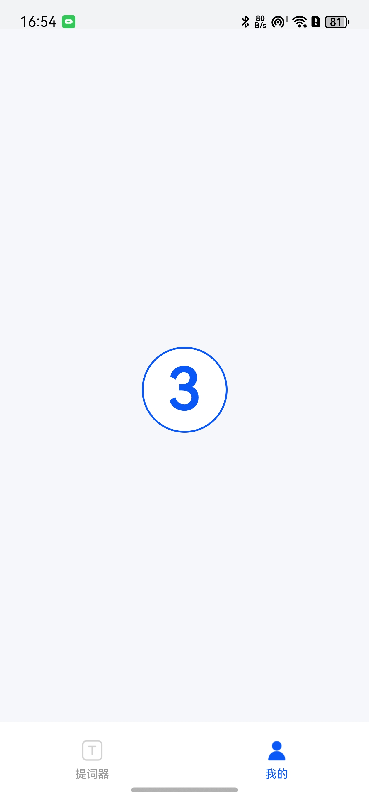

# 倒计时组件快速入门

## 目录

- [简介](#简介)
- [约束与限制](#约束与限制)
- [使用](#使用)
- [API参考](#API参考)
- [示例代码](#示例代码)

## 简介

本组件提供一个轻量级倒计时（Countdown）视图，用于在页面出现时自动开始从指定秒数倒计时，并在结束时触发回调。适用于录制准备、流程提示、计时提醒等场景。

- 页面出现即自动开始倒计时
- 可配置倒计时秒数 `time`
- 倒计时结束触发 `onFinish` 回调
- 全屏半透明黑色背景，白色大字体居中显示，支持数字切换动画效果

倒计时界面                    

 |


## 约束与限制
### 环境
- DevEco Studio版本：DevEco Studio 5.0.5 Release及以上
- HarmonyOS SDK版本：HarmonyOS 5.0.3 Release SDK及以上
- 设备类型：华为手机（包括双折叠和阔折叠）
- 系统版本：HarmonyOS 5.0.3及以上

### 权限

无

### 资源依赖
- 组件内置样式，无需额外图片资源。

## 使用

1. 安装组件。

   如果是在 DevEco Studio 使用插件集成组件，则无需安装组件，请忽略此步骤。

   如果是从生态市场下载组件，请参考以下步骤安装组件。

   a. 解压下载的组件包，将包中所有文件夹拷贝至您工程根目录的 `xxx` 目录下。

   b. 在项目根目录 `build-profile.json5` 添加 `countdown` 模块。

   ```typescript
   // 在项目根目录 build-profile.json5 填写 countdown 路径。其中 xxx 为组件存放的目录名
   "modules": [
     {
       "name": "countdown",
       "srcPath": "./xxx/countdown"
     }
   ]
   ```

   c. 在项目根目录 `oh-package.json5` 中添加依赖。

   ```typescript
   // xxx 为组件存放的目录名称
   "dependencies": {
     "countdown": "file:./xxx/countdown"
   }
   ```

2. 引入组件句柄。

   ```typescript
   import { Countdown } from 'countdown'
   ```

3. 调用组件，详细参数配置说明参见 [API参考](#API参考)。

## API参考

### 接口

Countdown(options: CountdownOptions)

倒计时组件。

**参数：**

| 参数名   | 类型                          | 是否必填 | 说明                   |
|----------|-------------------------------|------|------------------------|
| options  | [CountdownOptions](#CountdownOptions对象说明) | 是    | 倒计时组件的参数      |

### CountdownOptions对象说明

| 名称      | 类型     | 是否必填 | 说明                                 |
|-----------|----------|------|--------------------------------------|
| time      | number   | 是    | 倒计时秒数，默认 3                   |
| onFinish  | Function | 否    | 倒计时结束回调（无参数，无返回值）   |

> 说明：组件在 `aboutToAppear()` 生命周期钩子中自动开始倒计时；当倒计时归零时触发 `onFinish()` 并清理计时器。

## 示例代码

```typescript
import { Countdown } from 'countdown'

@Entry
@ComponentV2
export struct PrompterTest {
   @Local finished: boolean = false

   build() {
      Column({ space: 24 }) {
         // 倒计时 5 秒，结束后更新状态或执行逻辑
         Countdown({
            time: 5,
            onFinish: () => {
               this.finished = true
               console.info('倒计时结束')
            }
         })

         if (this.finished) {
            Text('倒计时已结束')
               .fontSize(18)
               .fontColor('#0A59F7')
         }
      }
      .width('100%')
         .height('100%')
         .align(Alignment.Center)
         .backgroundColor('#F5F7FA')      
   }
}
```
