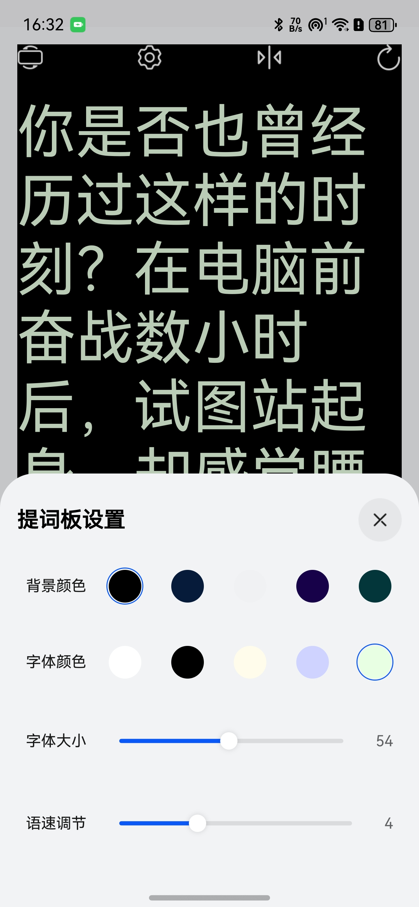

# 提词器组件快速入门

## 目录

- [简介](#简介)
- [约束与限制](#约束与限制)
- [使用](#使用)
- [API参考](#API参考)
- [示例代码](#示例代码)

## 简介

本组件提供了提词器（Teleprompter）能力，用于自动滚动显示文本并提供便捷的演讲/录制辅助配置。内置功能包括：

- 自动滚动文本（可调语速）
- 显示/隐藏设置面板（背景色、字体色、字体大小、语速、倒计时）
- 横屏模式切换
- 镜像翻转（适用于提词器镜面反射场景）
- 重新开始滚动

| 提词板界面                                                         | 提词板设置                                                          |
|---------------------------------------------------------------|----------------------------------------------------------------|
|  |  |


## 约束与限制

### 环境

- DevEco Studio版本：DevEco Studio 5.0.5 Release及以上
- HarmonyOS SDK版本：HarmonyOS 5.0.3 Release SDK及以上
- 设备类型：华为手机（包括双折叠和阔折叠）
- 系统版本：HarmonyOS 5.0.3及以上

### 权限

无

### 依赖

本组件依赖以下组件：

- countdown：倒计时组件

## 使用

1. 安装组件。

   如果是在 DevEco Studio 使用插件集成组件，则无需安装组件，请忽略此步骤。

   如果是从生态市场下载组件，请参考以下步骤安装组件。

   a. 解压下载的组件包，将包中所有文件夹拷贝至您工程根目录的 `xxx` 目录下。

   b. 在项目根目录 `build-profile.json5` 添加 `teleprompter` 模块和`countdown`倒计时模块。

   ```typescript
   // 在项目根目录 build-profile.json5 填写 teleprompter 路径。其中 xxx 为组件存放的目录名
   "modules": [
     {
       "name": "teleprompter",
       "srcPath": "./xxx/teleprompter"
     },
     {
       "name": "countdown",
       "srcPath": "./xxx/countdown"
     }
   ]
   ```

   c. 在项目根目录 `oh-package.json5` 中添加依赖。

   ```typescript
   // xxx 为组件存放的目录名称
   "dependencies": {
     "teleprompter": "file:./xxx/teleprompter",
   }
   ```

2. 引入组件句柄。

   ```typescript
    import { ConfigSheet, Prompter, PrompterController } from 'teleprompter'
    import { Countdown } from 'countdown';
   ```

3. 调用组件，详细参数配置说明参见 [API参考](#API参考)。

   组件内置顶部工具栏，支持横屏、打开设置面板、镜像翻转、重新开始等操作；设置面板包含背景色、字体色、字体大小、语速、倒计时等选项。

   ```typescript
   // 提词器主视图，内置顶部工具栏与设置面板
   Prompter()
   ```

## API参考

### 接口

Prompter()

提词器主组件。

**参数：**

| 参数名 | 类型 | 是否必填 | 说明                         |
|-----|----|------|----------------------------|
| 无   | -  | -    | 组件无外部入参，所有设置通过内置面板与内置控制器完成 |

### 事件

- 打开设置面板：通过全局事件触发 `emitter.emit('showConfigSheet')`
- 'showConfigSheet'为事件ID,如要修改需同步代码中对应的emitter的事件ID

### 说明

组件内置了完整的设置面板(样式无法定制),用户可以通过界面直接调整以下提词的配置：

- **背景颜色**：5种预设颜色可选（黑色、深蓝、浅灰、深紫、深青）
- **字体颜色**：5种预设颜色可选（白色、黑色、米黄、淡紫、淡绿）
- **字体大小**：范围 10-100
- **语速**：范围 1-10
- **倒计时**：范围 0-10秒

所有配置通过内置的设置面板进行调整，无需代码修改。

## 示例代码

```typescript
import { emitter } from '@kit.BasicServicesKit'
import { common } from '@kit.AbilityKit';
import { ConfigSheet, Prompter, PrompterController } from 'teleprompter'
import { Countdown } from 'countdown';

@Entry
@ComponentV2
export struct PrompterTest {
   @Local prompterController: PrompterController = PrompterController.instance;
   private context = this.getUIContext().getHostContext() as common.UIAbilityContext;

   onReturnClick() {
      if (this.prompterController.isLandscapeMode) {
         this.prompterController.setRotationMode(this.context)
      }
   }

   aboutToAppear(): void {
      this.prompterController.setStatusFontColor()
   }

   build() {
      Stack() {
         Column({ space: 16 }) {
            // 提词器主视图，内置顶部工具栏与设置面板
            Prompter({
               prompterController: this.prompterController,
               onReturnClick: () => {
                  this.onReturnClick()
               },
            })
               .layoutWeight(1)
            // 示例：从页面外部打开设置面板
            Button('打开设置面板')
               .onClick(() => {
                  this.prompterController.isShowConfigSheet = true
                  emitter.emit('showConfigSheet')
               })
               .width('100%')
               .height(40)
            ConfigSheet({
               configList: this.prompterController.configList,
               config: this.prompterController.config,
               isShowConfigSheet: this.prompterController.isShowConfigSheet,
               isLandscapeMode: this.prompterController.isLandscapeMode,
               isForSuspend: false,
               closeSheet: () => {
                  this.prompterController.isShowConfigSheet = false
               },
            })
         }
         .height('100%')

         Countdown({
            time: this.prompterController.config.countdown,
            onFinish: () => {
               this.prompterController.start()
            }
         })
      }
      .width('100%')
         .height('100%')
         .padding(16)
         .backgroundColor('#F5F7FA')
   }
}
```
