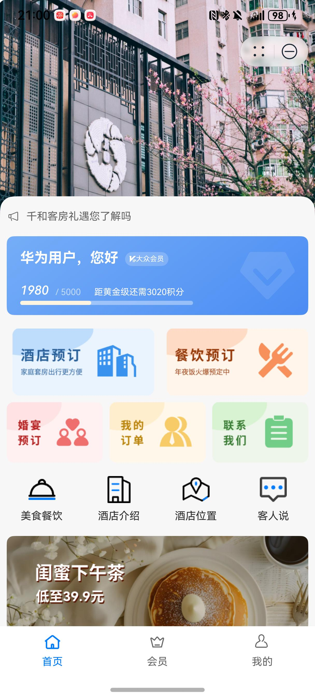
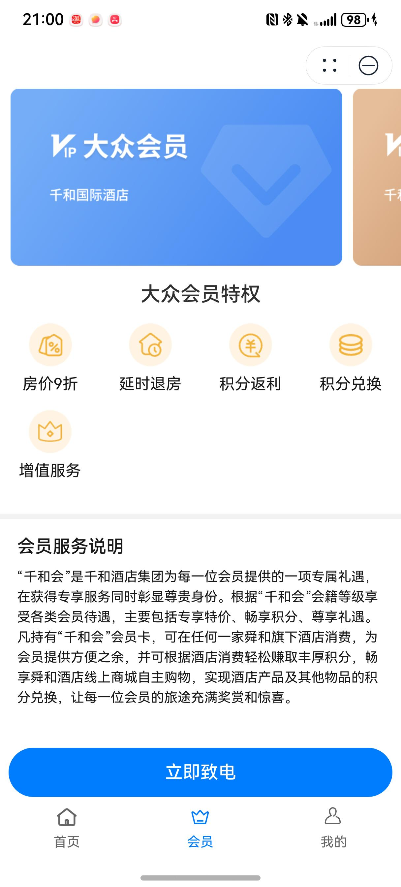
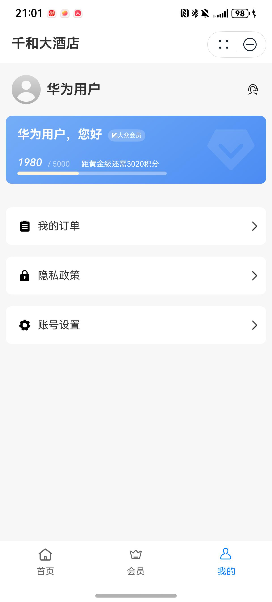
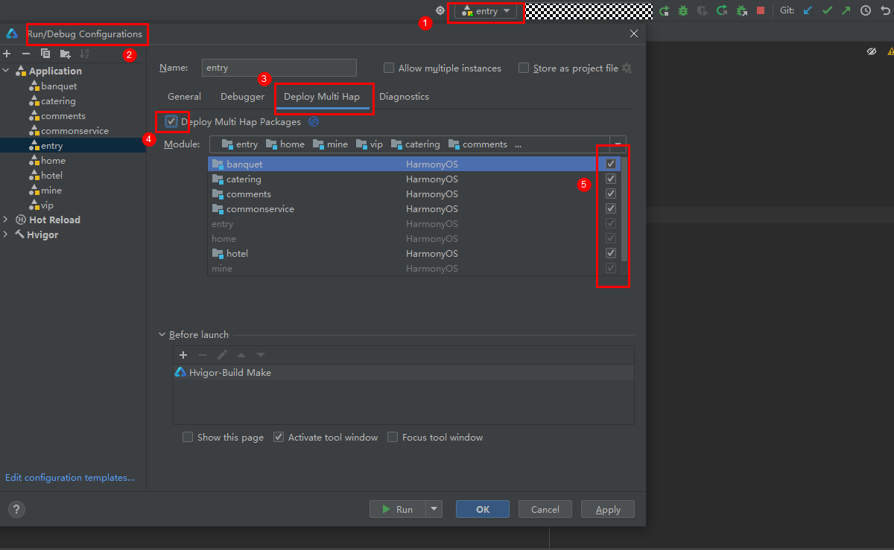

# 旅游(综合酒店)行业模板快速入门

## 目录

- [功能介绍](#功能介绍)
- [环境要求](#环境要求)
- [快速入门](#快速入门)
- [示例效果](#示例效果)
- [权限要求](#权限要求)
- [开源许可协议](#开源许可协议)


## 功能介绍

本模板为综合酒店类元服务提供了常用功能的开发样例，模板主要分首页、会员和我的三大模块：

* 首页：提供公告、会员信息、热销商品的展示，支持酒店、餐饮、宴会厅的预订。

* 会员：展示不同等级的会员卡片和等级说明。

* 我的：展示会员等级，支持订单、账号的管理。

本模板已集成华为账号、地图、支付等服务，只需做少量配置和定制即可快速实现华为账号的登录、酒店位置定位导航和购买商品等功能。


| 首页                                                         | 会员                                                         | 我的                                                         |
| ------------------------------------------------------------ | ------------------------------------------------------------ | ------------------------------------------------------------ |
|  |  |  |


本模板主要页面及核心功能如下所示：

```ts
综合酒店模板
 |-- 首页
 |    |-- 顶部轮播
 |    |-- 滚动公告
 |    |    └-- 公告详情
 |    |-- 会员卡片
 |    |-- 基础服务
 |    |    |-- 酒店预订
 |    |    |    |-- 酒店列表
 |    |    |    |-- 酒店详情
 |    |    |    |-- 房间详情
 |    |    |    └-- 预订房间
 |    |    |-- 餐饮预订
 |    |    |    |-- 餐厅列表
 |    |    |    |-- 餐厅详情
 |    |    |    |-- 团购详情
 |    |    |    └-- 提交订单
 |    |    └-- 宴会厅预订
 |    |         |-- 酒店列表
 |    |         |-- 宴会厅列表
 |    |         └-- 宴会厅详情
 |    |-- 我的订单
 |    |    |-- 订单列表
 |    |    └-- 订单详情
 |    └-- 更多功能
 |         |-- 美食餐饮
 |         |    └-- 同餐饮预订
 |         |-- 集团酒店
 |         |    └-- 酒店介绍
 |         |-- 酒店位置
 |         |    └-- 地图及导航
 |         |-- 客人说
 |         |    |-- 评论列表
 |         |    └-- 发布评论
 |         └-- 热销商品
 |              |-- 商品详情
 |              |-- 提交订单
 |              └-- 订单支付
 |-- 会员
 |    └-- 会员介绍
 └-- 我的
      |-- 用户信息
      |-- 会员卡片
      |-- 我的订单
      |-- 隐私政策
      └-- 账号设置
           └-- 修改信息
```


本模板工程代码结构如下所示：

```ts
FullServiceHotel
  |- commons                                       // 公共层
  |   |- commonlib/src/main/ets                    // 公共工具模块(har)
  |   |    |- constants 
  |   |    |     CommonContants.ets                // 公共常量
  |   |    |     CommonEnum.ets                    // 公共枚举
  |   |    |- types 
  |   |    |     Types.ets                         // 公共类型
  |   |    └- utils 
  |   |          AccountUtil.ets                   // 账号管理工具
  |   |          FormatUtil.ets                    // 日历、图片等格式管理工具
  |   |          LocationUtil.ets                  // 定位管理工具
  |   |          Logger.ets                        // 日志管理工具
  |   |          RouterModule.ets                  // 路由管理类
  |   |          PopViewUtils.ets                  // 公共弹窗
  |   |          TelUtil.ets                       // 拨号管理工具
  |   |          WindowUtil.ets                    // 窗口管理工具
  |   |  
  |   |- componentlib/src/main/ets                 // 公共组件模块(har)
  |   |     └- components 
  |   |          CommonBanner.ets                  // 公共沉浸式顶栏             
  |   |          CommonButton.ets                  // 公共按钮         
  |   |          CommonDivider.ets                 // 公共分割线          
  |   |          CommonHeader.ets                  // 公共标题栏         
  |   |          CommonScroll.ets                  // 公共沉浸式滚动栏         
  |   |          VipCard.ets                       // 会员卡组件 
  |   |   
  |   └- network/src/main/ets                      // 网络模块(har)
  |        |- apis                                 // 网络接口  
  |        |- mocks                                // 数据mock   
  |        |- models                               // 网络库封装    
  |        └- types                                // 请求和响应类型   
  |
  |- entry                                         // 应用层主包(hap)  
  |   └-  src/main/ets                                               
  |        |- entryability                                                               
  |        |- entryformability                                                        
  |        |- pages                              
  |        |    EmptyPage.ets                      // 入口页面
  |        |    MainEntry.ets                      // 主页面
  |        |- types                                // interface接口定义
  |        |- viewmodels                           // 与页面一一对应的vm层          
  |        └- widget                               // 卡片页面 
  |                                            
  |- features/service                              // 特性层
  |   |- banquet/src/main/ets                      // 宴会厅模块(hsp)
  |   |    |- common                               // 常量
  |   |    |- components                           // 抽离组件         
  |   |    |- pages                               
  |   |    |    BanquetHotelListPage.ets           // 酒店列表页
  |   |    |    BanquetInfoPage.ets                // 宴会厅详情页
  |   |    |    BanquetListPage.ets                // 宴会厅列表页
  |   |    |- types                                // interface类型定义
  |   |    └- viewmodels                           // 与页面一一对应的vm层          
  |   |     
  |   |- catering/src/main/ets                     // 订餐模块(hsp)
  |   |    |- components                           // 抽离组件   
  |   |    |- mapper                               // 接口数据到页面数据类型映射 
  |   |    |- models                               // class类型定义     
  |   |    |- pages                               
  |   |    |    FoodInfoPage.ets                   // 套餐详情页
  |   |    |    FoodOrderSubmitPage.ets            // 套餐预下单页
  |   |    |    RestaurantListPage.ets             // 餐厅列表页
  |   |    |    RestaurantPage.ets                 // 餐厅详情页
  |   |    └- viewmodels                           // 与页面一一对应的vm层  
  |   |  
  |   |- comments/src/main/ets                     // 评论模块(hsp)
  |   |    |- components                           // 抽离组件   
  |   |    |- constants                            // 常量 
  |   |    |- models                               // class类型定义     
  |   |    |- pages                               
  |   |    |    CommentListPage.ets                // 评论列表页
  |   |    |    SubmitCommentPage.ets              // 提交评论页
  |   |    |- types                                // interface类型定义
  |   |    └- viewmodels                           // 与页面一一对应的vm层   
  |   | 
  |   |- commonservice/src/main/ets                // 其他服务模块(hsp)
  |   |    |- Introduction                         // 酒店介绍   
  |   |    |- Location                             // 酒店位置 
  |   |    |- MyOrders                             // 用户订单     
  |   |    └- PrivacyPolicy                        // 隐私政策    
  |   | 
  |   └- hotel/src/main/ets                        // 订餐模块(hsp)
  |        |- components                           // 抽离组件   
  |        |- constants                            // 常量 
  |        |- mapper                               // 接口数据到页面数据类型映射 
  |        |- models                               // class类型定义     
  |        |- pages                               
  |        |    HotelListPage.ets                  // 酒店列表页
  |        |    HotelOrderPage.ets                 // 酒店客房预下单页
  |        |    RoomInfoPage.ets                   // 客房详情页
  |        |    RoomListPage.ets                   // 客房列表页
  |        |- types                                // interface类型定义
  |        └- viewmodels                           // 与页面一一对应的vm层 
  |    
  └- features/tabs    
      |- hotel                                     // 酒店tab页功能组合(hsp)
      | 
      |- mine                                      // 我的tab页功能组合(hsp)
      | 
      └- vip                                       // vip的tab页功能组合(hsp)
```


## 环境要求

### 软件

* DevEco Studio版本：DevEco Studio 5.0.0 Release及以上
* HarmonyOS SDK版本：HarmonyOS 5.0.0 Release SDK及以上

### 硬件

* 设备类型：华为手机（直板机）
* HarmonyOS版本：HarmonyOS 5.0.0 Release及以上


## 快速入门

###  配置工程

在运行此模板前，需要完成以下配置：

1. 在DevEco Studio中打开此模板。

2. 在AppGallery Connect创建元服务，将包名配置到模板中。

   a. 参考[创建元服务](https://developer.huawei.com/consumer/cn/doc/app/agc-help-createharmonyapp-0000001945392297)为元服务创建APPID，并进行关联。

   b. 返回应用列表页面，查看元服务的包名。

   c. 将模板工程根目录下AppScope/app.json5文件中的bundleName替换为创建元服务的包名。

3. 配置服务器域名。

   本模板接口均采用mock数据，由于元服务包体大小有限制，部分图片资源将从云端拉取，所以需为模板项目[配置服务器域名](https://developer.huawei.com/consumer/cn/doc/atomic-guides-V5/agc-help-harmonyos-server-domain-V5)，“httpRequest合法域名”需要配置为：`https://agc-storage-drcn.platform.dbankcloud.cn`

4. 配置华为账号服务。

   a. 将元服务的client ID配置到entry模块的module.json5文件，详细参考：[配置Client ID](https://developer.huawei.com/consumer/cn/doc/atomic-guides-V5/account-atomic-client-id-V5)。

   b. 添加公钥指纹，详细参考：[配置应用证书指纹](https://developer.huawei.com/consumer/cn/doc/app/agc-help-signature-info-0000001628566748#section5181019153511)。

   c. 如需获取用户真实手机号，需要申请phone权限，详细参考：[配置scope权限](https://developer.huawei.com/consumer/cn/doc/atomic-guides-V5/account-guide-atomic-permissions-V5)，并在端侧使用快速验证手机号码Button进行[验证获取手机号码](https://developer.huawei.com/consumer/cn/doc/atomic-guides-V5/account-guide-atomic-get-phonenumber-V5)。

5. 配置地图服务。

   a. 将元服务的client ID配置到entry模块的module.json5文件，如果华为账号服务已配置，可跳过此步骤。

   b. 添加公钥指纹，如果华为账号服务已配置，可跳过此步骤。

   c. [开通地图服务](https://developer.huawei.com/consumer/cn/doc/harmonyos-guides-V5/map-config-agc-V5#section16133115441516)。

6. 配置支付服务。

   华为支付当前仅支持商户接入，在使用服务前，需要完成商户入网、开发服务等相关配置，本模板仅提供了端侧集成的示例。详细参考：[支付服务接入准备](https://developer.huawei.com/consumer/cn/doc/harmonyos-guides-V5/payment-preparations-V5)

###  运行调试工程

1. 连接调试手机和PC。

2. 对元服务签名：由于模板中集成了华为账号、地图等服务，所以需要采用[手工签名](https://developer.huawei.com/consumer/cn/doc/harmonyos-guides-V5/ide-signing-V5#section297715173233)。

3. 配置多模块调试：由于本模板存在多个模块，运行时需确保所有模块安装至调试设备。

   a. 运行模块选择“entry”。

   b. 下拉框选择“Edit Configurations”，在“Run/Debug Configurations”界面，选择“Deploy Multi Hap”页签，勾选上模板中所有模块。

   

   c. 点击"Run"，运行模板工程。

## 示例效果

   [功能展示录屏](./screenshots/功能展示录屏.mp4)


## 权限要求

* 获取位置权限：ohos.permission.APPROXIMATELY_LOCATION，ohos.permission.LOCATION。
* 网络权限：ohos.permission.INTERNET	


## 开源许可协议

该代码经过[Apache 2.0 授权许可](http://www.apache.org/licenses/LICENSE-2.0)。
