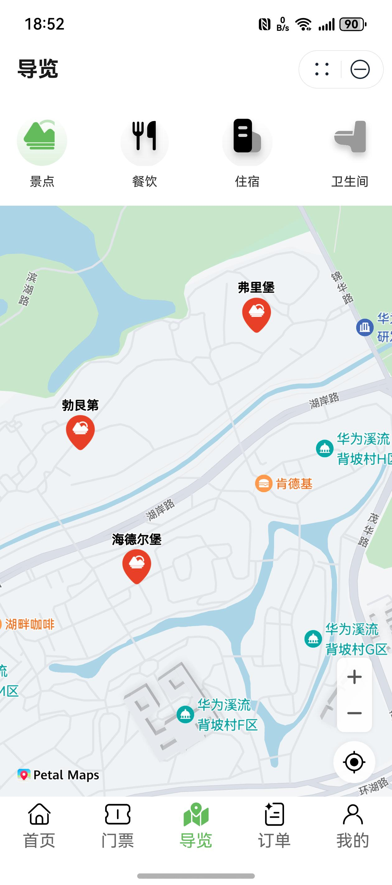

# 景区旅游行业模板快速入门

## 目录

- [功能介绍](#功能介绍)
- [环境要求](#环境要求)
- [快速入门](#快速入门)
- [示例效果](#示例效果)
- [权限要求](#权限要求)
- [开源许可协议](#开源许可协议)

## 功能介绍

本模板为景区旅游类元服务提供了常用功能的开发样例，模板主要分首页、门票、导览、订单和我的五大模块：
* 首页：提供景区轮播展示、公告信息、主要服务导航、热门景点推荐、攻略游记推荐。
* 门票：展示门票列表，支持门票的预订。
* 导览：提供景点、餐饮、住宿、卫生间的位置导航。
* 订单：支持对所有订单的管理。
* 我的：支持账号登录，提供订单入口，支持旅客信息、地址的管理。

本模板已集成华为账号、通话、地图、音频等服务，只需做少量配置和定制即可快速实现华为账号的登录、一键拨打服务电话、景点位置定位导航、景点信息讲解和购买门票和商品等功能。

| 首页                                      | 门票                                        | 导览                                       | 订单                                       | 我的                                      |
|-----------------------------------------|-------------------------------------------|------------------------------------------|------------------------------------------|-----------------------------------------|
|  |  |  |  |  |


本模板主要页面及核心功能如下所示：

```ts
景区旅游
 |-- 首页
 |    |-- 顶部轮播
 |    |-- 查看公告
 |    |    └-- 公告详情
 |    |-- 服务导航
 |    |    |-- 文旅商城
 |    |         └-- 文创商品列表
 |    |              └-- 文创商品详情
 |    |                   └-- 文创商品下单
 |    |         └-- 特色商品列表
 |    |              └-- 特色商品详情
 |    |                   └-- 特色商品下单
 |    |    |-- 票务预订
 |    |         └-- 门票列表
 |    |              └-- 门票分类详情
 |    |                   └-- 门票预订下单
 |    |    └-- 餐饮住宿
 |    |         └-- 餐饮列表
 |    |              └-- 餐饮详情
 |    |         └-- 住宿列表
 |    |              └-- 住宿详情
 |    |    └-- 游览线路
 |    |         └-- 线路列表
 |    |         └-- 线路详情
 |    |-- 热门景点
 |    |    |-- 景点列表
 |    |    |-- 景点详情
 |    |-- 攻略游记
 |    |    |-- 攻略列表
 |    |    |-- 攻略详情
 |-- 门票
 |    └-- 门票列表
 |         └-- 门票分类详情
 |              └-- 门票预订下单
 |-- 导览
 |    └-- 导览卡片
 |-- 订单
 |    └-- 门票订单
 |         └-- 门票订单详情
 |              └-- 取消订单    
 |              └-- 支付订单 
 |    └-- 购物订单
 |         └-- 购物订单详情
 |              └-- 取消订单    
 |              └-- 支付订单 
 └-- 我的
      |-- 用户信息
      |    └-- 修改信息
      |-- 我的订单
      |    └-- 购物订单
      |    └-- 门票订单
      |-- 常用旅客
      |    └-- 新增游客
      |    └-- 修改游客
      |    └-- 删除游客
      |-- 我的地址
      |    └-- 新增地址
      |    └-- 修改地址
      |    └-- 删除地址
      └-- 服务热线

```

本模板工程代码结构如下所示：

```ts
TrousitAttraction
  |- commons                                      // 公共层
  |  |- common/src/main/ets                       // 公共工具模块(har)
  |  |    |- constants 
  |  |    |     Contants.ets                      // 公共常量
  |  |    |- controller 
  |  |    |     DialogController.ets              // 公共弹窗controller类
  |  |    └- utils 
  |  |          └- LazyDataUtil 
  |  |             LazyDataSource.ets             // 懒加载工具
  |  |             ObservedArray.ets              // 懒加载工具
  |  |          └- MapUtil 
  |  |             LocationUtil.ets               // 华为地图工具
  |  |             PoiUtil.ets                    // 地点类型工具
  |  |             RouterUtil.ets                 // 地图跳转工具
  |  |          └- ShipUtil
  |  |             AddressUtil.ets                // 收货地址管理工具
  |  |             CascaderUtils.ets              // 省市区管理工具
  |  |          └- TouristUtil
  |  |             Index.ets                      // 游客信息工具
  |  |          AttractionUtil.ets                // 景点信息工具
  |  |          CallUtil.ets                      // 电话拨号工具
  |  |          CommonUtil.ets                    // 通用工具
  |  |          CryptoUtil.ets                    // 加解密工具
  |  |          DateUtil.ets                      // 日期工具
  |  |          HotlineUtil.ets                   // 热线电话工具
  |  |          Logger.ets                        // 日志工具
  |  |          PageUtil.ets                      // 页面信息工具
  |  |          TimeUtil.ets                      // 时间工具
  |  |  
  |  |- components/src/main/ets                   // 公共组件模块(har)
  |  |     └- components 
  |  |          AddressCardComponent.ets          // 地址卡片             
  |  |          ConfirmDialogComponent.ets        // 删除弹窗       
  |  |          FullLoadingComponent.ets          // 加载组件          
  |  |          NickNameDialogComponent.ets       // 昵称修改弹窗        
  |  |          OrderTypeDialog.ets               // 订单类型弹窗         
  |  |          SwiperComponent.ets               // 轮播图组件 
  |  |          TitleBar.ets                      // 公共标题栏 
  |  |          TouristCardComponent.ets          // 游客信息卡片
  |  |          ViewDetailComponent.ets           // 查看更多组件 
  |  |   
  |  └- network/src/main/ets                      // 网络模块(har)
  |        |- apis                                // 网络接口  
  |        |- mocks                               // 数据mock   
  |        |- constants                           // 接口常量  
  |        |- models                              // 网络库封装    
  |        └- types                               // 请求和响应类型 
  |  └- types/src/main/ets                        // 数据类型 
  |
  |- product                                      // 应用层  
  |  └- phone/src/main/ets                        // 主包(hap)                                                     
  |        |- entryability                                                                     
  |        |- entryformability                                                        
  |        |- pages                              
  |        |    Main.ets                          // 主页面
  |        |- model                               // 类型定义
  |        |- viewmodel                           // 与页面一一对应的vm层          
  |        └- widget                              // 卡片页面 
  |                                           
  |- features/functions                           // 特性层
  |   |- address/src/main/ets                     // 收货地址模块(hsp)
  |   |    |- mapper                              // 接口数据到页面数据类型映射        
  |   |    |- pages                              
  |   |    |    Address.ets                       // 地址详情页
  |   |    |    Addresses.ets                     // 地址列表页
  |   |    └- viewmodel                           // 与页面一一对应的vm层          
  |   |    
  |   |- catering/src/main/ets                    // 餐饮住宿模块(hsp)
  |   |    |- components                          // 抽离组件   
  |   |    |- mapper                              // 接口数据到页面数据类型映射 
  |   |    |- model                               // class类型定义     
  |   |    |- pages                              
  |   |    |    AccommodationDetail.ets           // 住宿详情页
  |   |    |    Catering.ets                      // 餐饮及住宿列表页
  |   |    |    CateringDetail.ets                // 餐厅详情页
  |   |    └- viewmodel                           // 与页面一一对应的vm层  
  |   | 
  |   |- mall/src/main/ets                        // 商城模块(hsp)
  |   |    |- mapper                              // 接口数据到页面数据类型映射   
  |   |    |- model                               // class类型定义     
  |   |    |- pages                              
  |   |    |    CommodityDetail.ets               // 商品列表页
  |   |    |    CommodityReserve.ets              // 商品下单页
  |   |    |    MallView.ets                      // 商城页
  |   |    └- viewmodel                           // 与页面一一对应的vm层   
  |   |
  |   |- note/src/main/ets                        // 攻略游记模块(hsp)
  |   |    |- mapper                              // 接口数据到页面数据类型映射   
  |   |    |- pages                               // 酒店位置 
  |   |    |    NoteDetail.ets                    // 攻略详情页
  |   |    |    Notes.ets                         // 攻略列表页
  |   |    |- viewmodel                           // 与页面一一对应的vm层        
  |   |
  |   |- route/src/main/ets                       // 推荐线路模块(hsp)
  |   |    |- mapper                              // 接口数据到页面数据类型映射 
  |   |    |- model                               // class类型定义     
  |   |    |- pages                              
  |   |    |    Route.ets                         // 推荐线路列表页
  |   |    |    RouteDetail.ets                   // 推荐线路详情页
  |   |- tourist/src/main/ets                     // 游客管理模块(hsp)
  |   |    |- components                          // 抽离组件 
  |   |    |- mapper                              // 接口数据到页面数据类型映射    
  |   |    |- pages                              
  |   |    |    TouristPage.ets                   // 游客详情页
  |   |    |    TouristPages.ets                  // 游客列表页
  |   |    |- viewmodel                           // 与页面一一对应的vm层
  |   |
  |- features/tabs                                // 特性层
  |   |- guide/src/main/ets                       // 导览模块(hsp)
  |   |    |- components                          // 抽离组件 
  |   |    |- mapper                              // 接口数据到页面数据类型映射
  |   |    |- model                               // class类型定义 
  |   |    |- pages                              
  |   |    |    GuideView.ets                     // 导览详情页
  |   |    └- viewmodel                           // 与页面一一对应的vm层
  |   |- home/src/main/ets                        // 首页模块(hsp)
  |   |    |- components                          // 抽离组件 
  |   |    |- mapper                              // 接口数据到页面数据类型映射
  |   |    |- model                               // class类型定义 
  |   |    |- pages                              
  |   |    |    AttractionDetail.ets             // 景点详情页
  |   |    |    Attractions.ets                  // 景点列表页
  |   |    |    BulletinDetail.ets               // 公告详情页
  |   |    |    Bulletins.ets                    // 公告列表页
  |   |    |    HomeView.ets                     // 首页
  |   |    └- viewmodel                          // 与页面一一对应的vm层   
  |   |- mine/src/main/ets                       // 我的模块(hsp)
  |   |    |- components                          // 抽离组件 
  |   |    |- model                              // class类型定义 
  |   |    |- pages                              
  |   |    |    EditPersonalInfo.ets             // 个人信息编辑页
  |   |    |    Hotlines.ets                     // 热线页
  |   |    |    MineView.ets                     // 我的页
  |   |    └- viewmodel                          // 与页面一一对应的vm层 
  |   |- order/src/main/ets                      // 订单模块(hsp)
  |   |    |- components                         // 抽离组件 
  |   |    |- model                              // class类型定义 
  |   |    |- mapper                             // 接口数据到页面数据类型映射
  |   |    |- pages                              
  |   |    |    CommodityOrderDetail.ets         // 购物订单详情页
  |   |    |    OrderView.ets                    // 订单列表页
  |   |    |    TicketOrderDetail.ets            // 门票订单详情页
  |   |    └- utils                              // 工具类 
  |   |    └- viewmodel                          // 与页面一一对应的vm层    
  |   |- ticket/src/main/ets                     // 门票模块(hsp)
  |   |    |- components                         // 抽离组件 
  |   |    |- model                              // class类型定义 
  |   |    |- mapper                             // 接口数据到页面数据类型映射
  |   |    |- pages                              
  |   |    |    TicketDetail.ets                 // 门票详情页
  |   |    |    TicketReserve.ets                // 门票预订页
  |   |    |    Tickets.ets                      // 门票列表页
  |   |    └- viewmodel                          // 与页面一一对应的vm层           
```


## 环境要求

### 软件
* DevEco Studio版本：DevEco Studio 5.0.0 Release及以上
* HarmonyOS SDK版本：HarmonyOS 5.0.0 Release SDK及以上
### 硬件
* 设备类型：华为手机（直板机）
* HarmonyOS版本：HarmonyOS 5.0.0 Release及以上


## 快速入门

###  配置工程
在运行此模板前，需要完成以下配置：

1. 在DevEco Studio中打开此模板。

2. 在AppGallery Connect创建元服务，将包名配置到模板中。

   a. 参考[创建元服务](https://developer.huawei.com/consumer/cn/doc/app/agc-help-createharmonyapp-0000001945392297)为元服务创建APPID，并进行关联。

   b. 返回应用列表页面，查看元服务的包名。

   c. 将模板工程根目录下AppScope/app.json5文件中的bundleName替换为创建元服务的包名。

3. 配置华为账号服务。

   a. 将元服务的client ID配置到phone模块的module.json5文件，详细参考：[配置Client ID](https://developer.huawei.com/consumer/cn/doc/atomic-guides-V5/account-atomic-client-id-V5)。

   b. 添加公钥指纹，详细参考：[配置应用证书指纹](https://developer.huawei.com/consumer/cn/doc/app/agc-help-signature-info-0000001628566748#section5181019153511)。
   
4. 配置地图服务。

   a. 将元服务的client ID配置到phone模块的module.json5文件，如果华为账号服务已配置，可跳过此步骤。

   b. 添加公钥指纹，如果华为账号服务已配置，可跳过此步骤。
   
   c. [开通地图服务](https://developer.huawei.com/consumer/cn/doc/harmonyos-guides-V5/map-config-agc-V5#section16133115441516)。

5. 配置支付服务。

   华为支付当前仅支持商户接入，在使用服务前，需要完成商户入网、开发服务等相关配置，本模板仅提供了端侧集成的示例。详细参考：[支付服务接入准备](https://developer.huawei.com/consumer/cn/doc/harmonyos-guides-V5/payment-preparations-V5)。

6.  获取收货地址需要申请相应权限，详细参考：[获取收货地址](https://developer.huawei.com/consumer/cn/doc/harmonyos-guides-V5/account-choose-adress-V5#section1061219267293)。

###  运行调试工程
1. 连接调试手机和PC。

2. 对元服务签名：由于模板中集成了华为账号、地图等服务，所以需要采用[手工签名](https://developer.huawei.com/consumer/cn/doc/harmonyos-guides-V5/ide-signing-V5#section297715173233)。

3. 配置多模块调试：由于本模板存在多个模块，运行时需确保所有模块安装至调试设备。
   
   a. 在DevEco Studio菜单选择“Run > Edit Configurations”，进入“Run/Debug Configurations”界面。
   
   b. 左侧导航选择“phone”模块，选择“Deploy Multi Hap”页签，勾选上模板中所有模块。
   
   c. 点击"Run"，运行模板工程。


## 示例效果

1. 门票预订

   [门票预订展示](./screenshots/devices/ticket_order.mp4)

2. 导览讲解

   [景点导览讲解](./screenshots/devices/attration_guide.mp4)

3. 导入地址

   [导入华为账号地址](./screenshots/devices/address_add.mp4)

## 权限要求

- 获取位置权限：ohos.permission.APPROXIMATELY_LOCATION、ohos.permission.LOCATION。
- 网络权限：ohos.permission.INTERNET

## 开源许可协议

该代码经过[Apache 2.0 授权许可](http://www.apache.org/licenses/LICENSE-2.0)。

