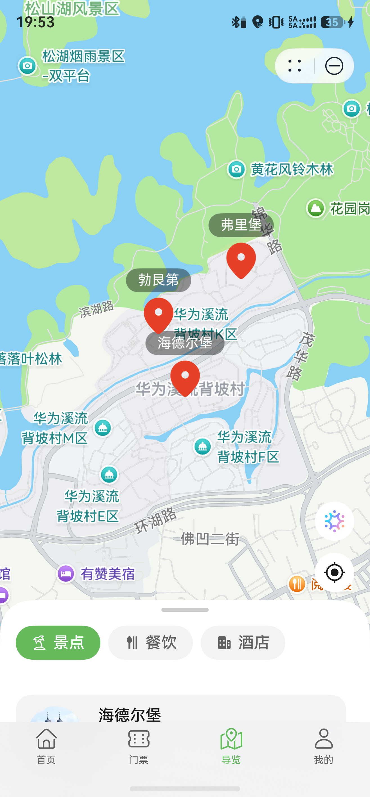
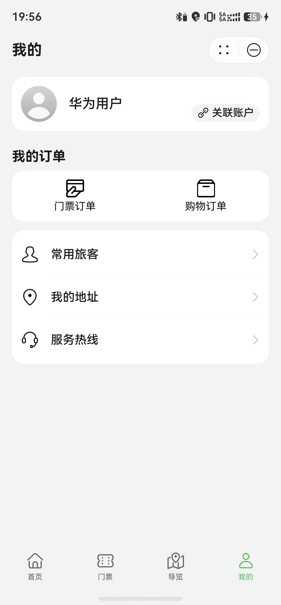
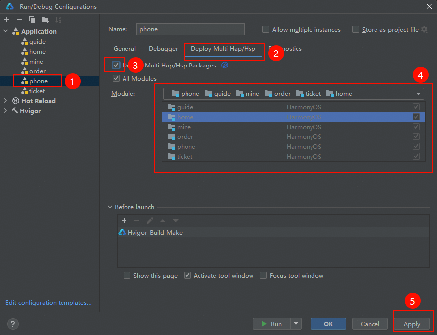
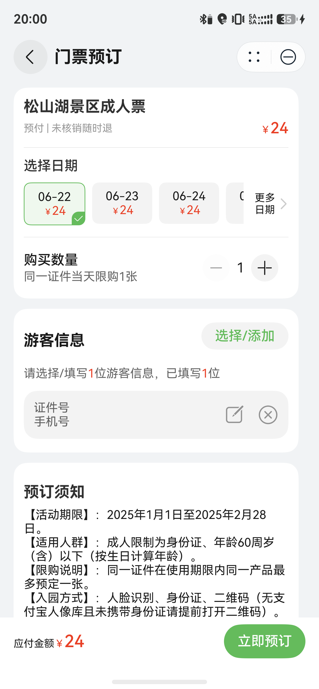
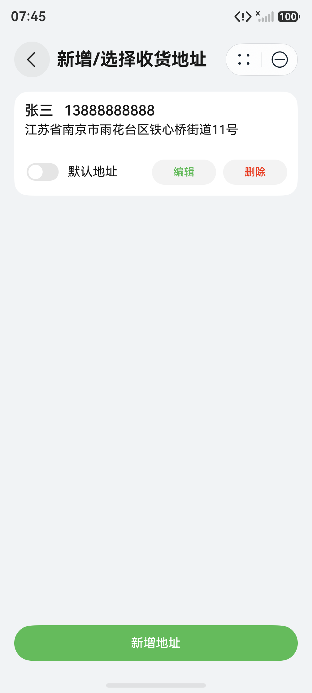

# 旅游（景区服务）应用模板快速入门

## 目录

- [功能介绍](#功能介绍)
- [约束与限制](#约束与限制)
- [快速入门](#快速入门)
- [示例效果](#示例效果)
- [开源许可协议](#开源许可协议)

## 功能介绍

您可以基于此模板直接定制应用，也可以挑选此模板中提供的多种组件使用，从而降低您的开发难度，提高您的开发效率。

此模板提供如下组件，所有组件存放在工程根目录的components下，如果您仅需使用组件，可参考对应组件的指导链接；如果您使用此模板，请参考本文档。

| 组件                                | 描述                              | 使用指导                                                 |
|-----------------------------------|---------------------------------|------------------------------------------------------|
| 景点播报组件（attraction_announcement）   | 提供景点介绍语音播报功能。                   | [使用指导](components/attraction_announcement/README.md) |
| 景区导览组件（attraction_guide）          | 提供景区景点及配套设施导览功能。                | [使用指导](components/attraction_guide/README.md)        |
| 景点实况组件（attraction_live）           | 提供景点实况情况介绍功能。                   | [使用指导](components/attraction_live/README.md)         |
| 周边餐饮住宿组件（catering_accommodation）  | 提供景区周边餐饮住宿浏览功能。                 | [使用指导](components/catering_accommodation/README.md)  |
| 通用图片预览组件（image_preview）            | 提供图片预览功能，支持一镜到底效果、动图、缩放等。      | [使用指导](components/image_preview/README.md)           |
| 服务热线组件（service_hotline）           | 提供景区服务热线查询与拨打功能。                | [使用指导](components/service_hotline/README.md)         |
| 常用游客管理组件（tourist_management）      | 提供常用游客查看与管理功能。                  | [使用指导](components/tourist_management/README.md)      |
| 游记组件（attraction_note）             | 提供景区游记浏览搜索、详情查看、游记评论、推荐线路查看等功能。 | [使用指导](components/attraction_note/README.md)         |
| 通用元服务登录/关联组件（atomicservice_login） | 提供元服务登录/关联手机号码，解除关联的功能。         | [使用指导](components/atomicservice_login/README.md)     |

本模板为景区旅游类元服务提供了常用功能的开发样例，模板主要分首页、门票、导览和我的四大模块：

* 首页：提供景区轮播展示、公告信息、主要服务导航、热门景点推荐、攻略游记推荐。
* 门票：展示门票列表，支持门票的预订。
* 导览：提供景点、餐饮、住宿的位置导航。
* 我的：支持关联华为账号，提供订单入口，支持旅客信息、地址的管理。

本模板已集成华为账号、通话、地图、音频等服务，只需做少量配置和定制即可快速实现关联华为账号、一键拨打服务电话、景点位置定位导航、景点信息讲解和购买门票和商品等功能。

| 首页                                     | 门票                                        | 导览                                       | 我的                                      |
|----------------------------------------|-------------------------------------------|------------------------------------------|-----------------------------------------|
|  |  |  |  |

本模板主要页面及核心功能如下所示：

```ts
景区旅游
 |-- 首页
 |    |-- 顶部轮播
 |    |-- 查看公告
 |    |    └-- 公告详情
 |    |-- 服务导航
 |    |    |-- 文旅商城
 |    |         └-- 文创商品列表
 |    |              └-- 文创商品详情
 |    |                   └-- 文创商品下单
 |    |         └-- 特色商品列表
 |    |              └-- 特色商品详情
 |    |                   └-- 特色商品下单
 |    |    |-- 票务预订
 |    |         └-- 门票列表
 |    |              └-- 门票分类详情
 |    |                   └-- 门票预订下单
 |    |    └-- 餐饮住宿
 |    |         └-- 餐饮列表
 |    |              └-- 餐饮详情
 |    |         └-- 住宿列表
 |    |              └-- 住宿详情
 |    |    └-- 游览线路
 |    |         └-- 线路列表
 |    |         └-- 线路详情
 |    |-- 热门景点
 |    |    |-- 景点列表
 |    |    |-- 景点详情
 |    |-- 攻略游记
 |    |    |-- 攻略列表
 |    |    |-- 攻略详情
 |-- 门票
 |    └-- 门票列表
 |         └-- 门票分类详情
 |              └-- 门票预订下单
 |-- 导览
 |    └-- 导览卡片
 └-- 我的
      |-- 用户信息
      |    └-- 修改信息
      |-- 我的订单
      |    └-- 购物订单
                └-- 购物订单详情
                └-- 取消订单    
                └-- 支付订单 
      |    └-- 门票订单
                └-- 门票订单详情
                └-- 取消订单    
                └-- 支付订单 
      |-- 常用旅客
      |    └-- 新增游客
      |    └-- 修改游客
      |    └-- 删除游客
      |-- 我的地址
      |    └-- 新增地址
      |    └-- 修改地址
      |    └-- 删除地址
      └-- 服务热线
```

本模板工程代码结构如下所示：

```ts
TouristAttraction
  |- commons                                        // 公共层
  |  |- common/src/main/ets                         // 公共工具模块(har)
  |  |    |- constants
  |  |    |    |- Constant.ets                      // 公共常量
  |  |    |    └- GridRowColSetting.ets             // 栅格配置常量
  |  |    |- controller
  |  |    |    └- DialogController.ets              // 公共弹窗controller类
  |  |    |- models
  |  |    |    |- AppBaseModel.ets                  // 基础数据模型
  |  |    |    └- BreakpointModel.ets               // 断点模型
  |  |    └- utils
  |  |          ├- AppStorageV2Util                 // 应用存储工具
  |  |          |    ├- AttractionUtil.ets          // 景点数据缓存工具类
  |  |          |    ├- HotlineUtil.ets             // 热线缓存工具类
  |  |          |    ├- LocationUtil.ets            // 景区位置缓存工具类
  |  |          |    └- TouristUtil.ets             // 游客缓存工具类
  |  |          ├- LazyDataUtil                     // 懒加载工具
  |  |          |    ├- LazyDataSource.ets          // 懒加载数据源工具类
  |  |          |    └- ObservedArray.ets           // 懒加载监听工具类
  |  |          ├- AccountUtil.ets                  // 账号信息工具
  |  |          ├- AppPrivacyUtils.ets              // 隐私工具
  |  |          ├- BreakpointUtils.ets              // 断点工具
  |  |          ├- CommonUtil.ets                   // 通用工具
  |  |          ├- Logger.ets                       // 日志工具
  |  |          ├- PermissionUtils.ets              // 权限工具
  |  |          └- SystemUtil.ets                   // 系统工具
  |
  |  |- uicomponents/src/main/ets                   // 公共组件模块(har)
  |  |     └- component
  |  |          ├- AddressCardComponent.ets         // 地址卡片组件
  |  |          ├- AsWebRichText.ets                // Web富文本组件
  |  |          ├- ComfirmDialogComponent.ets       // 确认弹窗组件
  |  |          ├- FullLoadingComponent.ets         // 全屏加载组件
  |  |          ├- NickNameDialogComponent.ets      // 昵称修改弹窗组件
  |  |          ├- SwiperComponent.ets              // 轮播图组件
  |  |          ├- TitleBar.ets                     // 公共标题栏组件
  |  |          └- ViewDetailComponent.ets          // 查看更多组件
  |
  |  |- network/src/main/ets                        // 网络模块(har)
  |  |     ├- apis                                  // 网络接口
  |  |     ├- constants                             // 接口常量
  |  |     ├- mapper                                // 数据映射方法
  |  |     ├- mocks                                // 数据mock
  |  |     ├- models                               // 网络库封装
  |  |     └- types                                // 请求和响应类型
  |
  |  └- types/src/main/ets                         // 数据类型模块(har)
  |       └- type                                  // 类型定义
  |
  |- product                                        // 应用层
  |  └- phone/src/main/ets                         // 主包模块(hap)
  |       |- entryability
  |       |    └- EntryAbility.ets                 // 主入口Ability
  |       |- entryformability
  |       |    └- EntryFormAbility.ets             // 表单入口Ability
  |       |- model
  |       |    └- TabBarInfo.ets                   // 标签栏信息模型
  |       |- pages
  |       |    ├- Index.ets                        // 应用首页
  |       |    └- Main.ets                         // 主页面
  |       |- viewmodel
  |       |    └- MainEntryVM.ets                  // 主页面视图模型
  |       └- widget
  |            └- pages
  |                 └- AttractionCard.ets          // 景点卡片组件
  |
  |- components                                     // 业务组件层
  |  ├- attraction_announcement/src/main/ets       // 景区播报组件
  |  |    ├- components                            // UI组件
  |  |    └- utils                                 // 工具类
  |  |
  |  ├- attraction_guide/src/main/ets              // 景区导览组件
  |  |    ├- components                            // UI组件
  |  |    ├- constants                             // 常量定义
  |  |    ├- mapper                                // 数据映射方法
  |  |    ├- model                                 // 类型定义
  |  |    └- viewmodel                             // 视图模型层
  |  |
  |  ├- attraction_live/src/main/ets               // 景点实况组件
  |  |    ├- component                             // UI组件
  |  |    ├- mapper                                // 数据映射方法
  |  |    ├- model                                 // 类型定义
  |  |    └- viewmodel                             // 视图模型层
  |  |
  |  ├- attraction_note/src/main/ets               // 游记组件
  |  |    ├- components                            // UI组件
  |  |    ├- constant                              // 常量定义
  |  |    ├- model                                 // 模型定义
  |  |    ├- pages                                 // 页面
  |  |    |    ├- PageDetail.ets                   // 游记详情页面
  |  |    |    ├- PageWaterFlow.ets                // 游记瀑布流页面
  |  |    |    └- RoutePageDetail.ets              // 推荐线路详情页面
  |  |    └- utils                                 // 工具类
  |  |
  |  ├- atomicservice_login/src/main/ets           // 元服务登录组件
  |  |    ├- common                               // 公共定义
  |  |    ├- components                           // UI组件
  |  |    ├- model                                // 数据模型
  |  |    ├- utils                                // 工具类
  |  |    └- views                                // 视图
  |  |
  |  ├- catering_accommodation/src/main/ets        // 周边餐饮住宿组件
  |  |    ├- component                            // UI组件
  |  |    ├- constant                             // 常量定义
  |  |    ├- mapper                               // 数据映射方法
  |  |    ├- model                                // 类型定义
  |  |    ├- pages                                // 页面
  |  |    |    ├- AccommodationDetail.ets          // 住宿详情页面
  |  |    |    ├- CateringAndAccommodation.ets    // 餐饮及住宿列表页面
  |  |    |    └- CateringDetail.ets              // 餐饮详情页面
  |  |    └- viewmodel                            // 视图模型层
  |  |
  |  ├- image_preview/src/main/ets                 // 图片预览组件
  |  |
  |  ├- module_base/src/main/ets                   // 基础模块组件
  |  |    ├- common                               // 公共定义
  |  |    ├- http                                 // 模拟请求
  |  |    ├- model                                // 类型定义
  |  |    ├- uicomponent                          // UI组件
  |  |    |    └- TitleBar.ets                    // 公共标题组件
  |  |    └- util                                 // 工具类
  |  |
  |  ├- service_hotline/src/main/ets               // 服务热线组件
  |  |    └- component
  |  |         └- Hotline.ets                     // 服务热线组件
  |  |
  |  └- tourist_management/src/main/ets            // 常用游客管理组件
  |       ├- components                           // 组件
  |       |    ├- ComfirmDialogComponent.ets      // 删除确认弹窗组件
  |       |    ├- Tourist.ets                     // 游客编辑页面
  |       |    ├- TouristCardComponent.ets        // 游客卡片组件
  |       |    └- Tourists.ets                    // 游客列表页面
  |       ├- mapper                               // 数据映射方法
  |       └- viewmodel                            // 视图模型层
  |
  └- features                                      // 特性层
      ├- guide/src/main/ets                        // 导览模块(hsp)
      |    ├- pages
      |    |    └- GuideView.ets                  // 导览详情页
      |    └- viewmodel
      |         └- GuideVM.ets                    // 导览视图模型
      |
      ├- home/src/main/ets                         // 首页模块(hsp)
      |    ├- components                          // 抽离组件
      |    |    ├- HotAttractions.ets             // 热门景点组件
      |    |    └- HotNotes.ets                   // 热门游记组件
      |    ├- mapper                              // 接口数据到页面数据类型映射
      |    │    └- Index.ets                      // 数据映射入口
      |    ├- model                               // 类型定义
      |    │    ├- Index.ets                      // 模块类型入口
      |    │    ├- BulletinInfo.ets               // 公告信息模型
      |    │    ├- CommodityInfo.ets              // 商品信息模型
      |    │    ├- CommodityTabInfo.ets           // 商品标签信息模型
      |    │    ├- FunctionModuleInfo.ets         // 功能模块信息模型
      |    │    ├- HomeRollupInfo.ets             // 首页汇总信息模型
      |    │    ├- HotAreaInfo.ets                // 热门区域信息模型
      |    │    ├- ParkingSlotInfo.ets            // 车位信息模型
      |    │    ├- RouteInfo.ets                  // 路线信息模型
      |    │    ├- RouteLineInfo.ets              // 路线详情信息模型
      |    │    └- WeatherInfo.ets                // 天气信息模型
      |    ├- pages
      |    │    ├- AttractionDetail.ets           // 景点详情页
      |    │    ├- AttractionImage.ets            // 景点图片页
      |    │    ├- Attractions.ets                // 景点列表页
      |    │    ├- BulletinDetail.ets             // 公告详情页
      |    │    ├- Bulletins.ets                  // 公告列表页
      |    │    ├- CommodityDetail.ets            // 商品详情页
      |    │    ├- CommodityReserve.ets           // 商品预定页
      |    │    ├- HomeView.ets                   // 首页
      |    │    ├- MallView.ets                   // 商城列表页
      |    │    └- Route.ets                      // 路线列表页
      |    ├- utils
      |    │    └- BreakPointUtils.ets            // 断点工具
      |    └- viewmodel                           // 视图模型层
      |         ├- CommodityDetailVM.ets          // 商品详情视图模型
      |         ├- CommodityVM.ets                // 商品视图模型
      |         └- HomePageVM.ets                 // 首页视图模型
      |
      ├- mine/src/main/ets                         // 我的模块(hsp)
      |    ├- common                              // 公共定义
      |    │    └- GridRowColSetting.ets          // 栅格配置常量
      |    ├- mapper                              // 接口数据到页面数据类型映射
      |    │    └- Index.ets                      // 数据映射入口
      |    ├- model                               // 类型定义
      |    │    ├- HotlineInfo.ets                // 热线信息模型
      |    │    ├- ManagementInfo.ets             // 管理信息模型
      |    │    ├- OrderTypeInfo.ets              // 订单类型信息模型
      |    │    └- PersonalInfo.ets               // 个人信息模型
      |    ├- pages
      |    │    ├- Addresses.ets                  // 地址列表页面
      |    │    ├- EditPersonalInfo.ets           // 个人信息编辑页
      |    │    ├- Hotlines.ets                   // 热线页面
      |    │    ├- MineView.ets                   // 我的页面
      |    │    └- TouristsPage.ets               // 游客列表页面
      |    └- viewmodel                           // 视图模型层
      |         ├- AddressVM.ets                  // 地址视图模型
      |         └- TouristVM.ets                  // 游客视图模型
      |
      ├- order/src/main/ets                        // 订单模块(hsp)
      |    ├- components                          // 抽离组件
      |    │    └- OrderEmpty.ets                 // 订单空状态组件
      |    ├- mapper                              // 接口数据到页面数据类型映射
      |    │    └- Index.ets                      // 数据映射入口
      |    ├- model                               // 类型定义
      |    │    ├- CommodityOrderInfo.ets         // 商品订单信息模型
      |    │    ├- OrderModuleInfo.ets            // 订单模块信息模型
      |    │    └- TicketOrderInfo.ets            // 门票订单信息模型
      |    ├- pages
      |    │    ├- CommodityOrderDetail.ets       // 购物订单详情页
      |    │    ├- OrderView.ets                  // 订单列表页
      |    │    ├- PaySuccess.ets                 // 支付成功页面
      |    │    └- TicketOrderDetail.ets          // 门票订单详情页
      |    ├- utils                               // 工具类
      |    │    └- Index.ets                      // 工具入口
      |    └- viewmodel                           // 视图模型层
      |         └- OrderPageVM.ets                // 订单页面视图模型
      |
      └- ticket/src/main/ets                       // 门票模块(hsp)
           ├- components                          // 抽离组件
           │    ├- CustomServiceDialog.ets        // 客服弹窗组件
           │    ├- TourDateManagement.ets         // 游览日期管理组件
           │    ├- TouristManagement.ets          // 游客管理组件
           │    └- UICalendar.ets                 // 日历组件
           ├- mapper                              // 接口数据到页面数据类型映射
           │    └- Index.ets                      // 数据映射入口
           ├- model                               // 类型定义
           │    ├- Index.ets                      // 模块类型入口
           │    └- TicketInfo.ets                 // 门票信息模型
           ├- pages
           │    ├- TicketDetail.ets               // 门票详情页
           │    ├- TicketReserve.ets              // 门票预订页
           │    └- Tickets.ets                    // 门票列表页
           └- viewmodel                           // 视图模型层
                └- TicketVM.ets                   // 门票视图模型
```

## 约束与限制

### 环境

* DevEco Studio版本：DevEco Studio 6.1.1 Release及以上
* HarmonyOS SDK版本：HarmonyOS 6.1.1 Release SDK及以上
* 设备类型：华为手机（包括双折叠和阔折叠）、平板
* HarmonyOS版本：HarmonyOS 6.1.0(23)及以上

### 权限

* 获取位置权限：ohos.permission.APPROXIMATELY_LOCATION、ohos.permission.LOCATION。
* 网络权限：ohos.permission.INTERNET、ohos.permission.GET_NETWORK_INFO

### 限制

* 小艺智能体功能支持的设备最低HarmonyOS版本：HarmonyOS 6.0.1(21)及以上。
* 小艺智能体功能不支持模拟器运行使用。

## 快速入门

### 配置工程

在运行此模板前，需要完成以下配置：

1. 在AppGallery Connect创建元服务，将包名配置到模板中。

   a. 参考[创建元服务](https://developer.huawei.com/consumer/cn/doc/app/agc-help-create-atomic-service-0000002247795706)
   为元服务创建APP ID，并将APP ID与应用进行关联。

   b. 返回应用列表页面，查看元服务的包名。

   c. 将模板工程根目录下AppScope/app.json5文件中的bundleName替换为创建元服务的包名。

2. 配置华为账号服务。

   将元服务的client
   ID配置到products/phone/src/main下的module.json5文件，详细参考：[配置Client ID](https://developer.huawei.com/consumer/cn/doc/harmonyos-guides/account-client-id)。

3. 配置地图服务。

   a. 将元服务的client ID配置到products/phone/src/main模块的module.json5文件，如果华为账号服务已配置，可跳过此步骤。

   b. [开通地图服务](https://developer.huawei.com/consumer/cn/doc/harmonyos-guides/map-config-agc)。

4. 配置支付服务。

   华为支付当前仅支持商户接入，在使用服务前，需要完成商户入网、开发服务等相关配置，本模板仅提供了端侧集成的示例。详细参考：[支付服务接入准备](https://developer.huawei.com/consumer/cn/doc/harmonyos-guides/payment-preparations)。

5. 对应用进行[手工签名](https://developer.huawei.com/consumer/cn/doc/harmonyos-guides/ide-signing#section297715173233)。

6. 添加手工签名所用证书对应的公钥指纹。详细参考：[配置应用签名证书指纹](https://developer.huawei.com/consumer/cn/doc/app/agc-help-cert-fingerprint-0000002278002933)。

7. 获取收货地址需要申请相应权限，详细参考：[获取收货地址](https://developer.huawei.com/consumer/cn/doc/harmonyos-guides/account-choose-address-dev)。

8. 申请小艺智能体服务，详细参考：[申请小艺智能体](https://developer.huawei.com/consumer/cn/doc/best-practices/bpta-agent#section524618504324)。

9. 配置服务通知，详细参考：[配置服务通知](https://developer.huawei.com/consumer/cn/doc/atomic-guides/push-as-service-noti)。

### 运行调试工程

1. 连接调试手机和PC。

2. 配置多模块调试：由于本模板存在多个模块，运行时需确保所有模块安装至调试设备。

   a. 在DevEco Studio菜单选择“Run > Edit Configurations”，进入“Run/Debug Configurations”界面。

   b. 左侧导航选择“phone”模块，选择“Deploy Multi Hap”页签，勾选上模板中所有模块。

    

   c. 点击"Run"，运行模板工程。

## 示例效果

1. 门票预订

   

2. 导览讲解

   

3. 导入地址

   

## 开源许可协议

该代码经过[Apache 2.0 授权许可](http://www.apache.org/licenses/LICENSE-2.0)。

